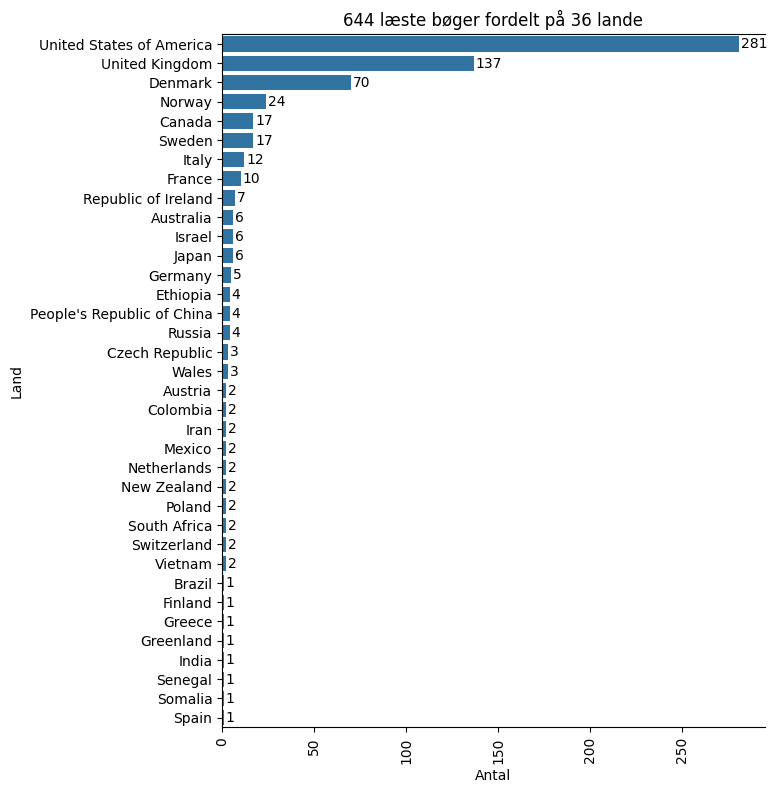
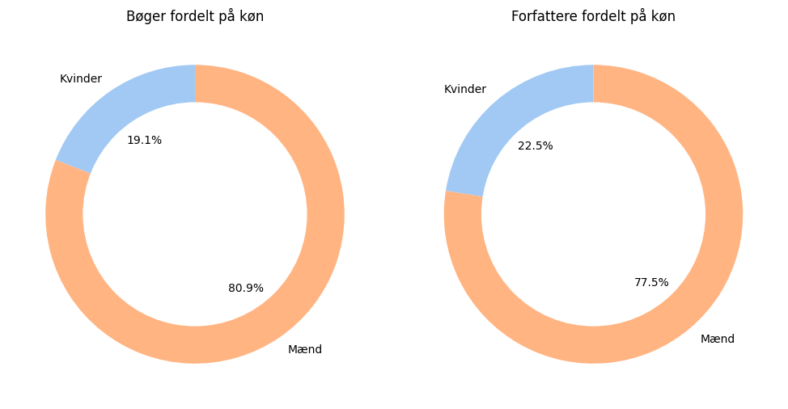

# Countries I Have Visited Through Books

I want to improve the geographical diversity of the books I read.

Goodreads doesn't show me where my book list authors are from, so I exported my data and wrote a bit of Python code to map the books to countries.

This is not a plug-and-play solution but a starter for people who want to do the same.



## Prerequisites

- Python
- Goodreads data exported as CSV
- Time to override the countries that the script got wrong or could not find

## Installation

```bash
python -m venv .venv
source ./.venv/bin/activate  # On Windows use `venv\Scripts\activate`
pip install -r requirements.txt
```

## Usage

1. Export your Goodreads data as CSV and save it in the `data/sources` folder.

2. Work in the [create_datasets.ipynb](src/create_datasets.ipynb) Jupyter notebook to get the countries of the authors of the books you read.

3. Manually adjust the [/data/sources/author_country_corrections.csv](data/sources/author_country_corrections.csv) file to your needs.

4. run the Jupyter notebook `country_distribution.ipynb` to get the distribution of the countries of the authors of the books you read.

5. run the Jupyter notebook `gender_distribution.ipynb` if you want to diversify beyond the nation state borders :)


